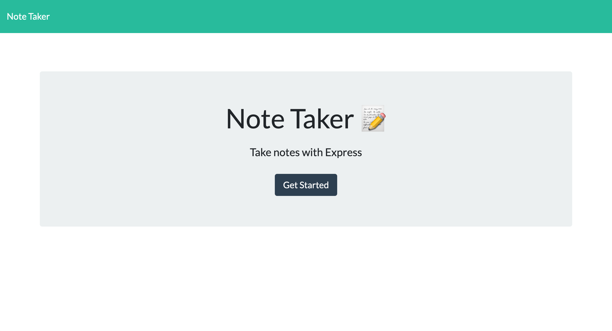
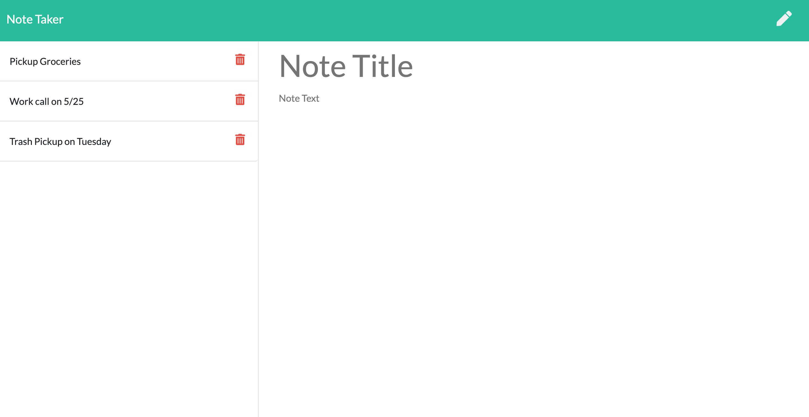
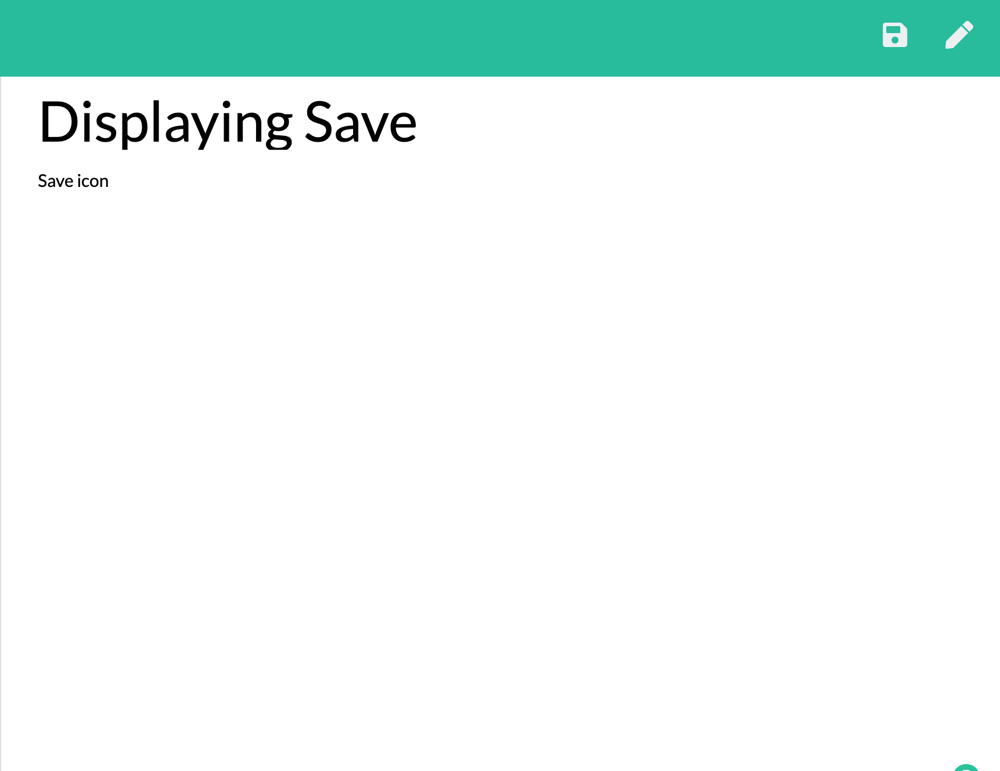
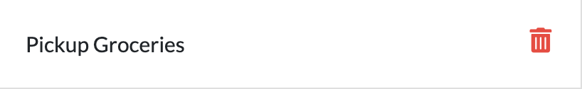

# Note Taker 
## Description 
Note Taker is a simple yet effective note taking website. The user inputs a note title and note description, hits the save button and the note is saved to a column on the left. The notes can be clicked on to view and will stay there even if a user closes the page. A delete button also appears next to the note for users to remove no longer needed notes. 
## Table of Contents 
* [Layout](#layout) 
* [Features](#features) 
* [Deployed](#deployed) 
* [Technology](#technology) 
* [Questions](#questions) 
## Layout 
Upon viewing the site, the user is brought to a homepage as shown below.
 
After clicking "Get Started", the user is then brought to the note page. The left side houses the notes column and the right is where notes are input. Clicking on each note title will display its content on the right.

## Features 
The note input section includes a note title and description, when users are finished with their note a save icon on the right will appear. Clicking this will save the note to the column.

Next to each note is also a red trash icon for notes the user wishes to remove.

## Deployed 
Note Taker is free to use and is deployed through heroku at 
https://safe-mesa-20030.herokuapp.com/ 
## Technology 
HTML, CSS, Bootstrap, Javascript, Node, npm, Express, GitHub, Heroku
## Questions 
GitHub: https://github.com/adambedingfield 
Email: adamcbedingfield@gmail.com 
